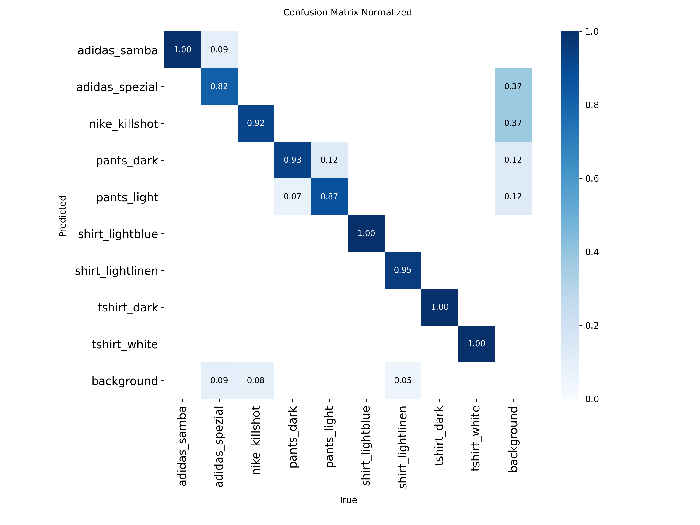

# YOLO Wardrobe Detection

This is an ongoing personal project focused on building a custom YOLOv8 object detection model to identify various wardrobe items (shirts, t-shirts, pants, and shoes) from images.

The goal is to create a lightweight, deployable model (target: Raspberry Pi 5) capable of recognizing different categories of clothing based on manually collected and labeled image data.

---

## Current Status

| Stage | Status |
|:---|:---|
| Dataset images collected | Completed |
| Image formatting and cleaning | Completed |
| Image labeling with bounding boxes (Label Studio) | Completed |
| Dataset structure organized for YOLOv8 | Completed |
| Model training and fine-tuning Trial Run| Completed |
| Optimization & Retraining | Ongoing |
| Deployment preparation | Pending |

- All wardrobe item images have been manually photographed.
- All images are now labeled with tight bounding boxes.
- Class labels have been consistently assigned.
- Dataset is formatted and ready for YOLOv8 training.
- Trial run is complete and first training results are in.


## Project Folder Structure

```
yolo_wardrobe_detection/
├── data/
│   ├── images/
│   │   ├── train/        # Training images
│   │   └── val/          # Validation images
│   ├── labels/
│   │   ├── train/        # YOLO format label files for train images
│   │   └── val/          # YOLO format label files for val images
│   ├── classes.txt       # List of all class names (for labeling tools)
│   └── data.yaml         # YOLO dataset configuration file
├── notebooks/            # Trial and evaluation scripts (in progress)
├── src/                  # (Empty for now — will contain training scripts)
├── outputs/
│   ├── models/           # (Will store trained model checkpoints)
│   ├── predictions/      # (Will store model prediction outputs)
│   └── logs/             # (Training and evaluation logs)
├── README.md             # This project readme
├── requirements.txt      # (Empty or partial — will be filled post-training)
```

---

## Notes

- Labeling was performed using **Label Studio**, with bounding boxes tightly drawn around clothing items, minimizing background noise.
- Training is currently in progress: the dataset preparation phase is complete, and fine-tuning has begun on a **YOLOv8n (Nano)** model.
- Deployment is planned for a **Raspberry Pi 5**, targeting efficient inference on CPU-only hardware.


## Dataset Creation Process

This dataset was created entirely manually for the purpose of fine-tuning a custom YOLOv8 object detection model to recognize wardrobe items (e.g. shirts, t-shirts, pants, shoes).

---

### 1. Image Collection

- All clothing items were **photographed individually** using a phone camera.
- Each item was placed on a neutral background (floor, door, or dark surface) for contrast.
- The camera was held steady in top-down or front-facing angle.
- Natural or room lighting was used (no flash).
- Images were exported to `.jpg` format and organized into folders by item type.
- No data augmentation was used at this stage.

**Example:**


---

### 2. File Cleaning and Organization

- All images were renamed using a clear pattern, e.g.:
  ```
  tshirt_white01.jpg, pants_dark12.jpg
  ```
- `.HEIC` and `.MOV` files were removed or ignored.
- Images were sorted into class folders for easier inspection before being merged into the final dataset.

**Example layout:**

```
/unprocessed/
├── tshirt_white01.jpg
├── tshirt_white02.jpg
├── pants_dark03.jpg
```

---

### 3. Train/Val Split

- Images were split randomly by their index into 80% training / 20% validation.
- Each split preserved class balance.
- Images were then placed in YOLO-compatible folders:

```
data/images/train/
data/images/val/
```

---

### 4. Annotation / Bounding Box Labeling

- Labeling was performed using **Label Studio**.
- Classes were predefined and consistent across all images.
- Boxes were drawn tightly around clothing items including all visual parts (e.g. sleeves, collars, soles).
- Exported format: YOLOv8 (text files per image with class and normalized coordinates).

**Example:**


---

### 5. YOLO Format Output Example

Each image has a `.txt` file with YOLO annotations in the format:

```
class_index x_center y_center width height
```

Example label file:

```
0 0.5049 0.5582 0.7654 0.8571
```

Where:
- `0` → Class index (e.g. `tshirt_white`)
- `0.5049 0.5582` → Center of the box (normalized)
- `0.7654 0.8571` → Width and height (normalized)

These are stored as:

```
data/labels/train/tshirt_white02.txt
```

---


## Trial Run Results

The initial fine-tuning run was conducted for a maximum of 100 epochs, but early stopping halted training at epoch 85, with the best performance reached at epoch 75.


- Precision (P): 0.979
- Recall (R): 0.969
- mAP@0.5: 0.975
- mAP@0.5–0.95: 0.920

Class-wise results:

- Most classes achieved near-perfect precision and recall, especially for pants, shoes, and light shirts.
- Minor weaknesses were seen in distinguishing dark t-shirts (precision ~0.90, recall ~0.91) and light blue shirts (precision ~0.98, recall ~0.92), suggesting some room for improvement.

Training efficiency:

- Preprocessing time: ~0.3 ms/image
- Inference time: ~26.7 ms/image
- Postprocessing time: ~0.3 ms/image

Model summary:
- 72 layers, ~3 million parameters, ~8.1 GFLOPs

The training curves show stable convergence, with losses consistently decreasing and no signs of overfitting. Future improvements could include expanding the dataset, especially for borderline classes, and experimenting with hyperparameter tuning





- Most classes were correctly classified with near-perfect confidence (≥95%), particularly shoe categories
- Background misclassification is to be monitored


## Next Steps

- Validate model performance and optimize it for Raspberry Pi inference.
- Prepare export formats (ONNX, CoreML) for deployment if needed.
- Scale dataset size & examples by using open source data collections & Grounding DINO for annotations.
- Explore other object detection frameworks and models for comparison.

---

*This project is actively under development.*
